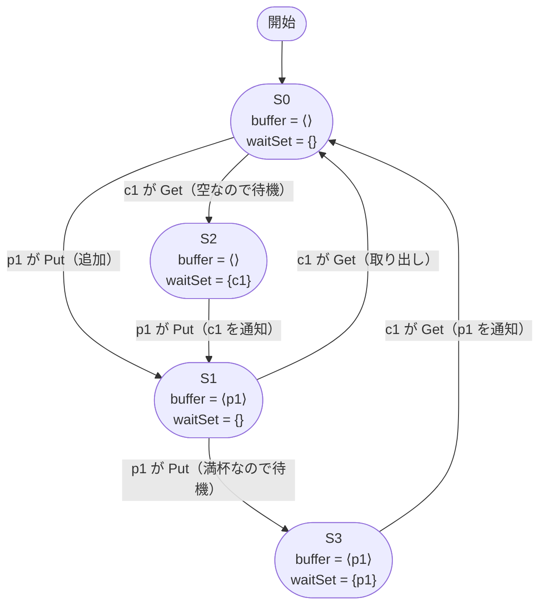

# 最小構成の状態グラフ — 状態と遷移を目で追う

出典: [learning.tlapl.us / BlockingQueue Tutorial / State Graph (Minimum Config)](https://learning.tlapl.us/blocking-queue/state-graph/)

前章と同じ BlockingQueue 仕様を、producer 1、consumer 1、buffer capacity 1 の最小構成
**p1c1b1** で検査します。この章の目的は TLC を正常終了させることではなく、TLC が探索する状態空間を
グラフとして読み、すべての状態と遷移をシステム上の出来事として説明できるようになることです。

前のページ: [examples/02-blocking-queue-tutorial/01-introduction](../01-introduction)（実装からモデルへの抽象化）

---

## 1. 先に状態数を予想する

[BlockingQueue.cfg](BlockingQueue.cfg) では次の値を使います。

```cfg
CONSTANTS
    BufCapacity = 1
    Producers = {p1}
    Consumers = {c1}
```

変数は `buffer` と `waitSet` の 2 つです。単純に組み合わせを数えると多数ありそうですが、`Put`、`Get`、
`Wait`、`Notify` の遷移を通って初期状態から到達できるのは、次の 4 状態だけです。

| 状態 | `buffer` | `waitSet` | 意味 |
| --- | --- | --- | --- |
| S0 | `<<>>` | `{}` | 初期状態。空で、どちらも実行可能 |
| S1 | `<<p1>>` | `{}` | 1 個入っていて、どちらも実行可能 |
| S2 | `<<>>` | `{c1}` | 空なので consumer が待機中 |
| S3 | `<<p1>>` | `{p1}` | 満杯なので producer が待機中 |

たとえば `buffer = <<>> /\ waitSet = {p1}` は到達できません。producer が待つのは満杯のときだけだからです。
同様に、満杯なのに consumer だけが待つ状態も到達できません。「変数の型として許される状態」と
「`Init` と `Next` から到達できる状態」は同じではありません。

---

## 2. 4 状態をグラフとして読む

矢印は、現在の状態で 1 つのスレッドが `Put` または `Get` を実行した結果、次の状態へ移ることを表します。



S0 と S1 だけを見ると、producer と consumer が交互に追加・取り出しを繰り返す通常のキューです。
S2 と S3 は操作できなかったスレッドが待機した状態です。ただし、もう一方のスレッドは必ず実行可能なので、
この最小構成では停止しません。

---

## 3. 6 本の遷移を一つずつ確認する

### S0 → S1: producer が空きへ追加する

`buffer` は空なので `Len(buffer) < BufCapacity` が成立します。`p1` を追加し、待機者がいないため `Notify` は
`waitSet` を変更しません。

```text
<<>>, {}  --Put(p1, p1)-->  <<p1>>, {}
```

### S0 → S2: consumer が空のため待つ

空のバッファからは取り出せません。`Get(c1)` の待機側が選ばれ、`c1` が `waitSet` に入ります。

```text
<<>>, {}  --Wait(c1)-->  <<>>, {c1}
```

### S1 → S0: consumer が 1 個取り出す

`Tail(<<p1>>)` は空のシーケンスです。待機者はいないため、通知しても `waitSet` は空のままです。

```text
<<p1>>, {}  --Get(c1)-->  <<>>, {}
```

### S1 → S3: producer が満杯のため待つ

容量 1 のバッファにすでに 1 個入っています。追加できないので `p1` が `waitSet` に入ります。

```text
<<p1>>, {}  --Wait(p1)-->  <<p1>>, {p1}
```

### S2 → S1: producer が追加し、consumer を起こす

実行可能なのは `p1` だけです。追加後の `Notify` が唯一の待機者 `c1` を取り除きます。

```text
<<>>, {c1}  --Put(p1, p1) + Notify(c1)-->  <<p1>>, {}
```

### S3 → S0: consumer が取り出し、producer を起こす

実行可能なのは `c1` だけです。取り出し後の `Notify` が唯一の待機者 `p1` を取り除きます。

```text
<<p1>>, {p1}  --Get(c1) + Notify(p1)-->  <<>>, {}
```

---

## 4. グラフからデッドロックの有無を判断する

このモデルで TLC が報告するデッドロックは、`Next` を満たす後続状態が 1 つもない到達可能状態です。
各ノードから出る矢印を数えると、次のようになります。

| 状態 | 後続状態 | 実行可能なスレッド |
| --- | --- | --- |
| S0 | S1、S2 | `p1`、`c1` |
| S1 | S0、S3 | `p1`、`c1` |
| S2 | S1 | `p1` |
| S3 | S0 | `c1` |

すべての状態に少なくとも 1 本の出る矢印があるため、p1c1b1 にはデッドロックがありません。これは実行例を
いくつか観察した結果ではなく、この有限モデルの到達可能状態をすべて調べた結果です。

ただし、この結論は **p1c1b1 に限られます**。スレッド数を増やすと新しい `waitSet` と通知相手の組み合わせが
増えるため、この 4 状態のグラフから大きな構成の安全性を結論づけることはできません。

---

## 5. TLC で状態グラフを生成する

まず通常どおり検査します。

```bash
cd examples/02-blocking-queue-tutorial/02-state-graph
java -cp "$(ls -d ~/.vscode/extensions/tlaplus.vscode-ide-*/tools/tla2tools.jar | tail -1)" \
  tlc2.TLC -workers 1 -config BlockingQueue.cfg BlockingQueue.tla
```

この環境での結果は次のとおりです。

```text
Model checking completed. No error has been found.
7 states generated, 4 distinct states found, 0 states left on queue.
The depth of the complete state graph search is 3.
```

状態グラフを Graphviz の DOT 形式で出力するには `-dump` を追加します。

```bash
java -cp "$(ls -d ~/.vscode/extensions/tlaplus.vscode-ide-*/tools/tla2tools.jar | tail -1)" \
  tlc2.TLC -workers 1 -dump dot StateGraph.dot \
  -config BlockingQueue.cfg BlockingQueue.tla
```

`StateGraph.dot` は TLC が生成する一時的な成果物なので、このリポジトリでは Git の管理対象外です。
Graphviz を導入済みなら SVG へ変換できます。

```bash
dot -Tsvg StateGraph.dot -o StateGraph.svg
```

DOT 内のノード名は状態の fingerprint であり、業務上の ID ではありません。ノードのラベルにある `buffer` と
`waitSet` を読んで S0〜S3 に対応づけます。`-dump dot,actionlabels` も指定できますが、この仕様では最上位の
次状態関係が `Next` なので、矢印の意味は変数値の差分と `Put` / `Get` の定義から読む必要があります。

---

## 6. `generated` と `distinct` が違う理由

TLC の `7 states generated` は、各状態から遷移先として作られた状態の延べ数です。S0 と S1 にはそれぞれ
2 本、S2 と S3 にはそれぞれ 1 本の遷移があるため、初期状態 1 個と遷移先 6 個を合わせて 7 個生成されます。

一方、S1 から戻る S0 や、S2 から到達する S1 はすでに見つかっています。重複を除いた結果が
`4 distinct states found` です。状態グラフの閉路は無限に実行できる振る舞いを表しますが、TLC は同じ状態を
何度も探索し直さないため、有限個のノードで探索を完了できます。

---

## 7. 触って確かめる

1. Mermaid の矢印を隠し、S0〜S3 の変数値だけから実行可能な遷移を復元する。
2. `Next` の producer 側または consumer 側を一時的にコメントアウトする。どの状態から出る矢印が消え、
   どこがデッドロックになるかを実行前に予想する。
3. `Notify` の `ELSE UNCHANGED waitSet` を削除する。待機者がいないときの `Put` / `Get` が実行不能になり、
   グラフがどう変わるか確認する。
4. `BufCapacity = 2` に変える。バッファの内容が `<<p1, p1>>` まで増え、4状態という説明がどこから崩れるか調べる。
5. `Consumers = {c1, c2}` に変える前に、`waitSet` に現れうる集合と通知相手の選択肢を書き出す。

変更後は必ず元へ戻し、p1c1b1 が 4 状態かつデッドロックなしになることを再確認してください。

---

## 次に読むもの

- [構成を大きくする](../03-larger-config) — consumer を増やし、最小モデルの成功を一般化できるか調べる
- [BlockingQueue 導入](../01-introduction) — 2 変数と各アクションのモデル化を復習する

## 参考資料

- [BlockingQueue Tutorial / State Graph (Minimum Config)](https://learning.tlapl.us/blocking-queue/state-graph/)
- [lemmy/BlockingQueue の対応リビジョン](https://github.com/lemmy/BlockingQueue/commit/9dfadd9d) — MIT License（[ライセンス表示](LICENSE.upstream)）
