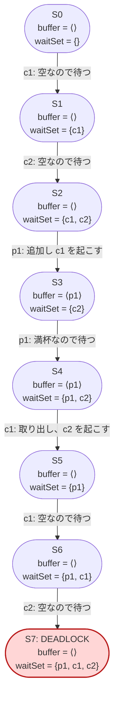

# 構成を大きくする — 最小モデルの成功を疑う

出典: [learning.tlapl.us / BlockingQueue Tutorial / Larger Configuration](https://learning.tlapl.us/blocking-queue/larger-config/)

前章の **p1c1b1** は 4 個の到達可能状態を持ち、デッドロックしませんでした。この章では仕様を一切変更せず、
consumer だけを 2 人へ増やした **p1c2b1** を検査します。小さい構成で見えなかった通知先の選択が現れ、
TLC はデッドロックを発見します。

前のページ: [examples/02-blocking-queue-tutorial/02-state-graph](../02-state-graph)（最小構成の状態グラフ）

---

## 1. 変えるのは `.cfg` だけ

[BlockingQueue.tla](BlockingQueue.tla) の `Init`、`Next`、`Put`、`Get`、`Wait`、`Notify` は前章と同じです。
変更するのは、モデル検査に使う定数の割り当てだけです。

```diff
 CONSTANTS
     BufCapacity = 1
     Producers = {p1}
-    Consumers = {c1}
+    Consumers = {c1, c2}
```

このリポジトリでは、比較時に設定を書き換えて戻す必要がないよう、次の 2 ファイルを用意しています。

| 設定 | 構成 | 用途 |
| --- | --- | --- |
| [BlockingQueueMinimum.cfg](BlockingQueueMinimum.cfg) | p1c1b1 | 前章の成功結果を再現する |
| [BlockingQueue.cfg](BlockingQueue.cfg) | p1c2b1 | consumer を増やしてデッドロックを検出する |

同じ仕様へ異なる `.cfg` を与えることで、「アルゴリズムは同じだが対象とするシステム構成が違う」モデルを比較できます。

---

## 2. なぜ consumer 1 人の追加が重要なのか

p1c1b1 では `waitSet` にいる consumer は `c1` だけです。producer の追加後に `Notify` が consumer を起こすなら、
相手は必ず `c1` です。

p1c2b1 では `c1` と `c2` が同時に待てます。さらに producer の `p1` も待機すると、`Notify` の候補には
異なる役割のスレッドが混ざります。

```tla
Notify ==
    IF waitSet # {}
    THEN \E thread \in waitSet : waitSet' = waitSet \ {thread}
    ELSE UNCHANGED waitSet
```

`\E thread \in waitSet` は、都合のよい相手を選ぶという意味ではありません。候補のどれを選ぶ遷移も仕様が許し、
TLC はそのすべてを探索します。空のバッファから consumer が要素を取り出せないように、起こされたスレッドの役割が
現在のバッファ状態と合わなければ、再び待機します。

---

## 3. 状態空間は 4 状態から 14 状態へ増える

`buffer` は容量 1 なので、空 `<<>>` または満杯 `<<p1>>` です。到達可能な `waitSet` をバッファ状態ごとに
整理すると、p1c2b1 の 14 状態を数えられます。

| `buffer` | 到達可能な `waitSet` | 状態数 |
| --- | --- | ---: |
| `<<>>` | `{}`、`{c1}`、`{c2}`、`{c1, c2}`、`{p1}`、`{p1, c1}`、`{p1, c2}`、`{p1, c1, c2}` | 8 |
| `<<p1>>` | `{}`、`{p1}`、`{c1}`、`{c2}`、`{p1, c1}`、`{p1, c2}` | 6 |
| 合計 |  | **14** |

変数の型から機械的に作れるすべての組み合わせではなく、`Init` から `Next` を繰り返して到達できる状態だけです。
たとえば満杯かつ `waitSet = {c1, c2}` は到達しません。2 人の consumer が待つのはバッファが空のときであり、
そこへ `p1` が追加すると `Notify` が少なくとも 1 人を待機集合から外すためです。

状態数はスレッド数に比例して少し増えるだけとは限りません。`waitSet` が集合なので、スレッドを追加すると部分集合の
候補が増え、そのうえ `Notify` の非決定的な選択によって遷移も分岐します。

---

## 4. TLC で p1c2b1 を検査する

```bash
cd examples/02-blocking-queue-tutorial/03-larger-config
java -cp "$(ls -d ~/.vscode/extensions/tlaplus.vscode-ide-*/tools/tla2tools.jar | tail -1)" \
  tlc2.TLC -workers 1 -config BlockingQueue.cfg BlockingQueue.tla
```

[BlockingQueue.cfg](BlockingQueue.cfg) では `CHECK_DEADLOCK TRUE` を明示しています。これは TLC の既定の動作でも
あります。明示的なデッドロック不変条件がなくても、到達可能状態に `Next` を満たす後続状態がなければ TLC は
`Deadlock reached` を報告します。

```text
Error: Deadlock reached.
27 states generated, 14 distinct states found, 0 states left on queue.
The depth of the complete state graph search is 8.
```

`TypeOK` と `CapacityOK` は破れていません。変数の型が正しく、容量を超過しなくても、すべてのスレッドが待機して
システム全体が停止することはあります。「キューのデータ構造が壊れない」と「処理を続けられる」は別の性質です。

---

## 5. 反例をシステム上の出来事として読む

TLC が示す反例の一つは、次の 7 ステップです。S7 が後続状態のないデッドロックです。



自然言語で読み下すと次のようになります。

1. バッファが空なので `c1` と `c2` が順に待つ。
2. `p1` が 1 個追加し、待機中の `c1` を起こす。`c2` は待ったままになる。
3. `p1` がもう一度追加しようとするが、容量 1 ですでに満杯なので待つ。
4. `c1` が要素を取り出す。その通知が producer の `p1` ではなく consumer の `c2` を起こす。
5. バッファは空なので、実行した `c1` と起こされた `c2` はどちらも再び待つ。
6. `p1` も待ったままであり、全スレッドが `waitSet` に入る。

最後は `RunningThreads = {}` です。`Next` は `RunningThreads` から実行するスレッドを選ぶため、候補がなく、
後続状態を生成できません。問題は「通知が失われた」ことではなく、共有待機集合から**現在は進めない consumer を
通知できる**ことです。

---

## 6. 最小構成と比較する

比較用設定を実行します。

```bash
java -cp "$(ls -d ~/.vscode/extensions/tlaplus.vscode-ide-*/tools/tla2tools.jar | tail -1)" \
  tlc2.TLC -workers 1 -config BlockingQueueMinimum.cfg BlockingQueue.tla
```

| 構成 | 生成状態数 | 異なる状態数 | 深さ | 結果 |
| --- | ---: | ---: | ---: | --- |
| p1c1b1 | 7 | 4 | 3 | デッドロックなし |
| p1c2b1 | 27 | 14 | 8 | デッドロックあり |

「p1c1b1 を全探索した」という結果は正しいままです。誤りは、その結果をほかの構成へ一般化することです。
小さいモデルは反例を短くし、状態空間を理解しやすくしますが、検証したい非決定性が現れないほど小さくしてはいけません。

この例では、同じ役割の待機スレッドと、異なる役割を誤って通知できる状況を作るため、少なくとも片方の役割に
2 スレッドが必要でした。モデルの大きさは現実の最大値ではなく、調べたい相互作用が現れる最小値から選びます。

---

## 7. 完全な状態グラフを出力する

上流教材は p1c2b1 の状態グラフを掲載しています。ローカルでは、デッドロック検出用設定を残したまま、グラフ出力専用の
[BlockingQueueGraph.cfg](BlockingQueueGraph.cfg) を使います。この設定だけは `CHECK_DEADLOCK FALSE` です。

```bash
java -cp "$(ls -d ~/.vscode/extensions/tlaplus.vscode-ide-*/tools/tla2tools.jar | tail -1)" \
  tlc2.TLC -workers 1 -dump dot StateGraph.dot \
  -config BlockingQueueGraph.cfg BlockingQueue.tla
```

Graphviz を導入済みなら SVG へ変換できます。

```bash
dot -Tsvg StateGraph.dot -o StateGraph.svg
```

`CHECK_DEADLOCK FALSE` はグラフ全体を正常終了で出力するための設定であり、デッドロックを解消しません。
S7 に相当する `waitSet = {p1, c1, c2}` のノードには、依然として出る矢印がありません。正しさの判定には必ず
`BlockingQueue.cfg` を使います。生成される `.dot` と `.svg` は一時的な可視化なので Git の管理対象外です。

---

## 8. 触って確かめる

1. 実行前に、p1c2b1 で新しく増える `waitSet` を p1c1b1 と比較して列挙する。
2. TLC の反例で、`Notify` がどちらの consumer を起こすかを入れ替えた対称な経路を探す。
3. `CHECK_DEADLOCK FALSE` へ変更して通常検査を実行する。成功表示になっても S7 から出る遷移が増えないことを確認する。
4. `Producers = {p1, p2}`、`Consumers = {c1}` の **p2c1b1** に入れ替える。実行前に、デッドロック時の
   `buffer` と `waitSet` を予想する。
5. consumer を 3 人へ増やし、異なる状態数と最短反例の深さがどう変わるか記録する。

この章ではまだ仕様を修正しません。まず「どの設定で」「どの選択が」「どの停止状態へ至ったか」を再現可能な形で
説明することを優先します。

---

## 次に読むもの

- [BlockingQueue Tutorial / Debug State Graph](https://learning.tlapl.us/blocking-queue/debug-config/) — producer と consumer を入れ替えた構成で状態グラフを調べる
- [最小構成の状態グラフ](../02-state-graph) — 4 状態と 6 遷移の読み方を復習する

## 参考資料

- [BlockingQueue Tutorial / Larger Configuration](https://learning.tlapl.us/blocking-queue/larger-config/)
- [lemmy/BlockingQueue の対応リビジョン](https://github.com/lemmy/BlockingQueue/commit/607a169d) — MIT License（[ライセンス表示](LICENSE.upstream)）
