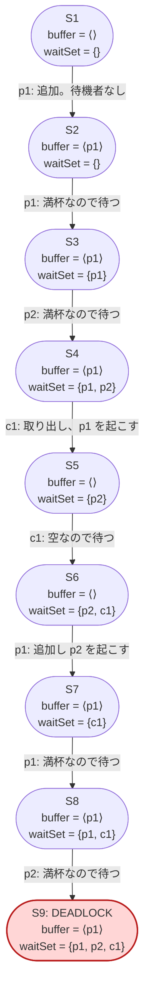

# 状態グラフのデバッグ — 反例を選びながら探索する

出典: [learning.tlapl.us / BlockingQueue Tutorial / Debug State Graph](https://learning.tlapl.us/blocking-queue/debug-config/)

前章では consumer を増やした **p1c2b1** でデッドロックを見つけました。この章では役割を入れ替え、
producer を 2 人にした **p2c1b1** を検査します。仕様は変更しません。

この構成には**デッドロック状態が 2 つ**あります。TLC は最初に見つけた 1 つを報告して止まるため、
既定の実行だけでは残りが見えません。そこで `TLCExt!PickSuccessor` を使い、デッドロックへ入る遷移の
直前で TLC を止めて、その後続状態を「進む / 飛ばす」対話的に選びます。

前のページ: [examples/02-blocking-queue-tutorial/03-larger-config](../03-larger-config)（構成を大きくする）

---

## 1. 構成を p2c1b1 に入れ替える

```diff
 CONSTANTS
     BufCapacity = 1
-    Producers = {p1}
-    Consumers = {c1, c2}
+    Producers = {p1, p2}
+    Consumers = {c1}
```

このディレクトリのファイルは次のとおりです。仕様本体 [BlockingQueue.tla](BlockingQueue.tla) は
01〜03 章と同一で、増えるのはデバッグ用の拡張モジュールだけです。

| ファイル | 役割 |
| --- | --- |
| [BlockingQueue.cfg](BlockingQueue.cfg) | p2c1b1 の通常検査。`CHECK_DEADLOCK TRUE` |
| [BlockingQueueGraph.cfg](BlockingQueueGraph.cfg) | 全状態グラフ出力専用。`CHECK_DEADLOCK FALSE` |
| [BlockingQueueDebug.tla](BlockingQueueDebug.tla) | `PickSuccessor` によるデバッグ用拡張 |
| [BlockingQueueDebug.cfg](BlockingQueueDebug.cfg) | 対話的探索の設定。`ACTION_CONSTRAINT NoDeadLock` |

---

## 2. まず通常どおり検査する

```bash
cd examples/02-blocking-queue-tutorial/04-debug-config
java -cp "$(ls -d ~/.vscode/extensions/tlaplus.vscode-ide-*/tools/tla2tools.jar | tail -1)" \
  tlc2.TLC -workers 1 -config BlockingQueue.cfg BlockingQueue.tla
```

```text
Error: Deadlock reached.
40 states generated, 22 distinct states found, 1 states left on queue.
The depth of the complete state graph search is 9.
```

注目すべきは最後の `1 states left on queue` です。TLC はデッドロックを見つけた時点で探索を打ち切るため、
キューには未探索の状態が残っています。「反例が 1 本出た」は「問題が 1 つだった」を意味しません。

報告される反例は 9 状態で、最後がデッドロックです。



分岐点は S6 → S7 です。バッファが空で `p2` と `c1` が待っているところへ `p1` が 1 個追加し、その `Notify` が
consumer の `c1` ではなく producer の `p2` を起こします。起こされた `p2` はバッファが満杯なので何もできません。
そのあと `p1` が 2 個目を入れようとして待ち（S8）、残った `p2` も待ちに入った時点（S9）で `waitSet` が
全スレッドになります。S9 では `RunningThreads = {}` なので、`Next` が選べるスレッドがなく後続状態を作れません。

いずれの構成でも、デッドロックの形は同じです。**バッファの状態と噛み合わない相手を `Notify` が起こせる**ため、
起こされたスレッドが何もできずに再び待ち、最後に全員が待機集合へ入ります。

---

## 3. 到達可能状態は 22 個、うちデッドロックは 2 個

`BufCapacity = 1` なので `buffer` は `⟨⟩`、`⟨p1⟩`、`⟨p2⟩` のいずれかです。

| `buffer` | 到達可能な `waitSet` | 状態数 |
| --- | --- | ---: |
| `⟨⟩` | `{}`、`{p1}`、`{p2}`、`{c1}`、`{p1, c1}`、`{p2, c1}` | 6 |
| `⟨p1⟩` | `{}`、`{p1}`、`{p2}`、`{c1}`、`{p1, p2}`、`{p1, c1}`、`{p2, c1}`、`{p1, p2, c1}` | 8 |
| `⟨p2⟩` | 同上 | 8 |
| 合計 | | **22** |

バッファが空の状態では `{p1, p2}` と `{p1, p2, c1}` が現れません。producer が待つのは満杯のときだけであり、
2 人がそろって待っている状態からバッファが空になるには `Get` が必要で、その `Get` の `Notify` が必ず
どちらか一方を起こすためです。

デッドロックは、バッファが満杯かつ全員が待機している次の 2 状態です。

- `buffer = ⟨p1⟩`、`waitSet = {p1, p2, c1}`
- `buffer = ⟨p2⟩`、`waitSet = {p1, p2, c1}`

2 つは `p1` と `p2` を入れ替えただけの対称な状態です（この対称性は 07 章で `SYMMETRY` として明示します）。
どちらへ至る経路も長さ 9 で、S6 でバッファへ追加するのが `p1` か `p2` かだけが違います。

---

## 4. `PickSuccessor` で後続状態を選ぶ

TLC を止めて残りのデッドロックも見るために、[BlockingQueueDebug.tla](BlockingQueueDebug.tla) を使います。

```tla
EXTENDS BlockingQueue, TLCExt

NoDeadLock ==
    PickSuccessor(waitSet' # (Producers \cup Consumers))
```

`PickSuccessor(exp)` は、`exp` が FALSE に評価されたときだけ対話的に後続状態の採否を尋ね、TRUE のときは
そのまま探索を続けます。ここでは「次状態の `waitSet` が全スレッド」、つまりデッドロックへ落ちる遷移でだけ
停止します。`waitSet'` を参照するので、これは状態式ではなくアクション式です。設定ファイルでは
`ACTION_CONSTRAINT` に指定します。

```cfg
ACTION_CONSTRAINT NoDeadLock
```

```bash
java -cp "$(ls -d ~/.vscode/extensions/tlaplus.vscode-ide-*/tools/tla2tools.jar | tail -1)" \
  tlc2.TLC -workers 1 -config BlockingQueueDebug.cfg BlockingQueueDebug.tla
```

デッドロックへ入る遷移に到達するたび、次のプロンプトが出ます。

```text
Extend behavior of length 8 with a "Next" step
  [<Action line 51, col 5 to line 55, col 25 of module BlockingQueue>]?
  (Yes/no/explored/states/diff):
```

| 入力 | 意味 |
| --- | --- |
| `yes` | この後続状態を採用する。デッドロック状態へ進み、TLC は反例を報告して止まる |
| `no` | この後続状態を捨てる。探索は続き、ほかの経路を調べられる |
| `states` | 現在の状態と候補の後続状態を表示する |
| `diff` | 現在の状態との差分だけを表示する |
| `explored` | 探索済みの状態数などの情報を表示する |

`TLCExt` は `tla2tools.jar` に同梱されているため、この教材では
[CommunityModules](https://github.com/tlaplus/CommunityModules) を別途用意しなくても動きます。

> `PickSuccessor` は標準入力から読み取ります。必ず `-workers 1` で、対話できる端末から実行してください。

---

## 5. 対話の結果を確かめる

**すべて `no` と答える**と、デッドロックへ入る遷移を 4 回すべて捨てることになり、TLC は正常終了します。

```text
Model checking completed. No error has been found.
40 states generated, 20 distinct states found, 0 states left on queue.
The depth of the complete state graph search is 8.
```

| 実行 | 生成状態数 | 異なる状態数 | 深さ | 結果 |
| --- | ---: | ---: | ---: | --- |
| `BlockingQueue.cfg`（通常検査） | 40 | 22 | 9 | デッドロック、未探索 1 件 |
| `BlockingQueueDebug.cfg`（すべて `no`） | 40 | 20 | 8 | エラーなし |

異なる状態数が 22 から 20 に減るのは、捨てた 2 つのデッドロック状態がちょうど探索から外れるためです。
**ここで「エラーなし」と出ても、デッドロックが直ったわけではありません。**見たくない状態を自分で隠しただけです。
`PickSuccessor` は仕様の調査手段であり、正しさの判定には使いません。判定には常に
[BlockingQueue.cfg](BlockingQueue.cfg) を使います。

逆に、途中まで `no` で進んで**あるところで `yes` と答える**と、そのとき選んだ経路がそのまま反例になります。
これによって、TLC が既定で選ぶのとは別のデッドロック（`buffer = ⟨p2⟩` の側）へ意図的に到達できます。

---

## 6. 状態グラフを出力する

前章と同じく、デッドロック検査の設定はそのまま残し、グラフ出力専用の
[BlockingQueueGraph.cfg](BlockingQueueGraph.cfg)（`CHECK_DEADLOCK FALSE`）を使います。

```bash
java -cp "$(ls -d ~/.vscode/extensions/tlaplus.vscode-ide-*/tools/tla2tools.jar | tail -1)" \
  tlc2.TLC -workers 1 -dump dot,colorize StateGraph.dot \
  -config BlockingQueueGraph.cfg BlockingQueue.tla

dot -Tsvg StateGraph.dot -o StateGraph.svg
```

出力されたグラフでは、**出る矢印を持たないノードが 2 つ**あります。それが上で数えた 2 つのデッドロック状態です。
グラフを目で追うときは、まず出次数 0 のノードを探し、そこへ入る辺を逆向きにたどります。生成される
`.dot` と `.svg` は一時的な可視化なので Git の管理対象外です。

---

## 7. 触って確かめる

1. `BlockingQueueDebug.cfg` を実行し、最初のプロンプトで `states` と `diff` を試して表示の違いを確かめる。
2. 1 回目のプロンプトで `no`、2 回目で `yes` と答え、得られる反例が既定の反例と何ステップ目から分かれるか調べる。
3. `NoDeadLock` を `PickSuccessor(FALSE)` に書き換えて実行し、すべての遷移で停止することを確認する
   （小さな構成でだけ現実的な設定です）。
4. `NoDeadLock` を `PickSuccessor(TLCGet("level") < 5)` に変え、深さ 5 以降だけ対話する挙動を確かめる。
5. `Producers = {p1, p2}`、`Consumers = {c1, c2}` の **p2c2b1** に広げ、異なる状態数と最短反例の深さを記録する。
   実行前に、デッドロック状態がいくつになるかを予想する。

この章でもまだ仕様は直しません。次章では、ここで目で見つけた「全員が待機」という状態を、
TLC の既定のデッドロック検出ではなく**不変条件として明示的に書く**方法へ進みます。

---

## 次に読むもの

- [BlockingQueue Tutorial / Safety (Deadlock)](https://learning.tlapl.us/blocking-queue/deadlock/) — デッドロックを不変条件で表す
- [構成を大きくする](../03-larger-config) — p1c2b1 の 14 状態と反例を復習する

## 参考資料

- [BlockingQueue Tutorial / Debug State Graph](https://learning.tlapl.us/blocking-queue/debug-config/)
- [TLCExt モジュール](https://github.com/tlaplus/tlaplus/blob/master/tlatools/org.lamport.tlatools/src/tla2sany/StandardModules/TLCExt.tla) — `PickSuccessor` の定義
- [CommunityModules](https://github.com/tlaplus/CommunityModules) — 上流教材が案内する追加モジュール集
- [lemmy/BlockingQueue の対応リビジョン](https://github.com/lemmy/BlockingQueue) — MIT License（[ライセンス表示](LICENSE.upstream)）
