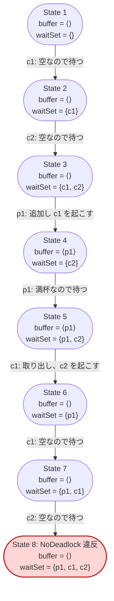

# デッドロックの安全性 — 「全員待機」を不変条件として書く

出典: [learning.tlapl.us / BlockingQueue Tutorial / Safety](https://learning.tlapl.us/blocking-queue/safety/)

03〜04 章では、TLC が既定で行う `Deadlock reached` の検出に任せてデッドロックを見つけました。この章では
同じ現象を、TLC の機能ではなく**仕様の側に書かれた不変条件**として表します。構成は 03 章と同じ **p1c2b1**
に戻し、反例が同じ振る舞いであることを確認します。

前のページ: [examples/02-blocking-queue-tutorial/04-debug-config](../04-debug-config)（状態グラフのデバッグ）

---

## 1. 増えるのは 1 行の定義と 1 行の `INVARIANT`

[BlockingQueue.tla](BlockingQueue.tla) の `Init`、`Next`、`Put`、`Get`、`Wait`、`Notify` は 01〜04 章と同一です。
末尾に次の定義を追加します。

```tla
NoDeadlock ==
    waitSet # (Producers \cup Consumers)
```

「待機集合が全スレッドと一致することはない」、つまり**全スレッドが同時に待つ状態には決して到達しない**という
主張です。上流教材ではこの定義を `Invariant` という名前で導入しています。本教材では `TypeOK` / `CapacityOK` と
並べたときに意味が読み取れるよう `NoDeadlock` と呼びます（上流の `TypeInv` に当たるのが `TypeOK` です）。

構成は 03 章と同じ p1c2b1 に戻します。

```diff
 CONSTANTS
     BufCapacity = 1
-    Producers = {p1, p2}
-    Consumers = {c1}
+    Producers = {p1}
+    Consumers = {c1, c2}

 INVARIANT TypeOK
 INVARIANT CapacityOK
+INVARIANT NoDeadlock
```

このディレクトリのファイルは次のとおりです。

| ファイル | 役割 |
| --- | --- |
| [BlockingQueue.tla](BlockingQueue.tla) | 仕様本体 + `NoDeadlock` |
| [BlockingQueue.cfg](BlockingQueue.cfg) | 不変条件で検出する。`CHECK_DEADLOCK FALSE` |
| [BlockingQueueBuiltin.cfg](BlockingQueueBuiltin.cfg) | 比較用。`NoDeadlock` なし・`CHECK_DEADLOCK TRUE` |

---

## 2. 安全性と不変条件

**安全性 (safety)** は「悪いことは決して起きない」という形の性質です。TLA+ では、これを**不変条件**
（すべての到達可能状態で成り立つ状態述語）として書くのが基本形になります。TLC は状態を生成するたびに
不変条件を評価し、FALSE になった状態へ至る経路をそのまま反例として出力します。

| 種類 | 主張の形 | 例 | 反例の形 |
| --- | --- | --- | --- |
| 安全性 | 悪いことは決して起きない | `NoDeadlock`、`TypeOK`、`CapacityOK` | **有限**の状態列（悪い状態で終わる） |
| ライブネス | よいことはいつか起きる | 「待っている consumer はいつか取り出す」 | **無限**の振る舞い（ループ） |

この章で扱うのは安全性だけです。ライブネスと公平性は `03-liveness-fairness` 以降で扱います。

`NoDeadlock` は状態述語です。`waitSet'` のようなプライム付きの変数を含まないため、`ACTION_CONSTRAINT` に
指定した 04 章の `NoDeadLock`（`PickSuccessor(waitSet' # ...)`）とは別物である点に注意してください。
似た名前ですが、前者は検査する性質、後者は探索を止めるための道具です。

---

## 3. 不変条件として検査する

```bash
cd examples/02-blocking-queue-tutorial/05-safety
java -cp "$(ls -d ~/.vscode/extensions/tlaplus.vscode-ide-*/tools/tla2tools.jar | tail -1)" \
  tlc2.TLC -workers 1 -config BlockingQueue.cfg BlockingQueue.tla
```

```text
Error: Invariant NoDeadlock is violated.
Error: The behavior up to this point is:
State 1: <Initial predicate>
/\ buffer = <<>>
/\ waitSet = {}
...
State 8: <Next line 52, col 5 to line 56, col 25 of module BlockingQueue>
/\ buffer = <<>>
/\ waitSet = {p1, c1, c2}

26 states generated, 14 distinct states found, 1 states left on queue.
The depth of the complete state graph search is 8.
```

反例は 8 状態で、03 章で `Deadlock reached` として報告されたものと同じ振る舞いです。



`TypeOK` と `CapacityOK` は 8 状態すべてで成り立っています。**型が正しいことは、システムが進めることを
何も保証しません。**壊れた状態に至らないことと、止まらないことは別の性質であり、別の不変条件として
書き分ける必要があります。

---

## 4. 既定のデッドロック検出との違い

比較用の設定を実行します。`NoDeadlock` を外し、TLC の既定検出だけに任せた検査です。

```bash
java -cp "$(ls -d ~/.vscode/extensions/tlaplus.vscode-ide-*/tools/tla2tools.jar | tail -1)" \
  tlc2.TLC -workers 1 -config BlockingQueueBuiltin.cfg BlockingQueue.tla
```

| 設定 | 報告 | 生成状態数 | 異なる状態数 | キュー残 | 深さ |
| --- | --- | ---: | ---: | ---: | ---: |
| [BlockingQueue.cfg](BlockingQueue.cfg)（不変条件） | `Invariant NoDeadlock is violated.` | 26 | 14 | 1 | 8 |
| [BlockingQueueBuiltin.cfg](BlockingQueueBuiltin.cfg)（既定検出） | `Deadlock reached.` | 27 | 14 | 0 | 8 |

反例の状態列は完全に同じで、違いは検出の**タイミング**です。不変条件は状態を生成した時点で評価されるため、
State 8 を生成した瞬間に止まります（未探索の状態が 1 個キューに残る）。既定のデッドロック検出は、その状態を
キューから取り出して後続状態を計算し、1 つも作れないと分かった時点で報告します。そのため生成状態数が 1 多く、
キュー残が 0 になります。両方を有効にすると、先に評価される不変条件違反のほうが報告されます。

同じものを見つけるのに、わざわざ仕様へ書く理由は次のとおりです。

- **意図が仕様に残る。** `CHECK_DEADLOCK` は検査器の設定であり、`.cfg` を差し替えれば消えます。
  `NoDeadlock` は「このシステムに求める性質」として `.tla` に残り、レビューの対象になります。
- **後続状態の有無ではなく、状態そのものを見ている。** 既定検出が答えるのは「`Next` を満たす後続状態があるか」
  というモデル検査上の問いです。07 章以降で `VIEW` や `SYMMETRY`、状態制約を導入すると、この問いの答えは
  探索の設定に左右されます。不変条件は変数の値だけを見るため、設定に引きずられません。
- **名前が付く。** 12 章で待機集合を分離したあと、修正が何を保証したのかを `NoDeadlock` という名前で
  参照できます。

なお、この仕様では両者は同じ状態集合を指します。どのスレッドも `Put` / `Get` の片側（追加・取り出し）が
できなければ必ずもう片側（`Wait`）ができるため、`Next` が実行可能であることは `RunningThreads # {}`、
すなわち `waitSet # (Producers \cup Consumers)` と同値だからです。一般の仕様では「後続状態がない」原因は
これに限らないため、両者が一致するとは限りません。

---

## 5. 実装のログとの比較

上流教材が強調するのは、同じバグを Java 実装で観測する場合との差です。p2c1b1 相当の実装は、数千行の
ログを出したあとにようやく停止します。どのスレッドがいつ `wait()` に入り、どの `notify()` が誰を起こしたかを
そのログから復元する作業が、デッドロック調査の大半を占めます。

TLC が出すのはそれと同じ現象の 8 状態です。しかも、各状態は変数の値そのもの（`buffer` と `waitSet`）であり、
ログ行の順序から状態を再構成する必要がありません。反例が短いことは偶然ではなく、TLC が幅優先で探索し、
**最短の反例**を返すためです。

---

## 6. 触って確かめる

1. `NoDeadlock` を `waitSet # (Producers \cup Consumers)` から `Cardinality(waitSet) < 2` に変えて実行し、
   より短い反例が出ること、そしてそれが「デッドロックではない」ことを確かめる。
2. 構成を 04 章と同じ p2c1b1 に変え、`NoDeadlock` 違反として報告される反例の深さを記録する。
3. `CHECK_DEADLOCK` を `TRUE` にしたまま `INVARIANT NoDeadlock` も残して実行し、どちらが先に報告されるかを
   確かめる。
4. `TypeOK` をわざと `buffer \in Seq(Consumers)` に書き換えて実行し、型の違反がどの状態で報告されるかを見る。
   `NoDeadlock` 違反とどちらが先に出るか予想してから実行する。
5. `BufCapacity = 2` に増やして実行する。結果を予想してから走らせ、違反が出るかどうか、出ないならその理由を
   `Put` と `Notify` の定義に戻って説明する（producer が 1 人であることが効きます）。

この章でもまだ仕様は直しません。次章では、構成ごとに `.cfg` を書き分けるのをやめ、
**複数の構成を一度の探索で扱う**方法（定数を変数にする）へ進みます。

---

## 次に読むもの

- [定数から変数へ](../06-variables) — 一回の探索で複数構成を扱う（[上流ページ](https://learning.tlapl.us/blocking-queue/variables/)）
- [状態グラフのデバッグ](../04-debug-config) — p2c1b1 の 2 つのデッドロックを対話的に探索する
- [構成を大きくする](../03-larger-config) — 同じ 8 状態が `Deadlock reached` として出る様子を復習する

## 参考資料

- [BlockingQueue Tutorial / Safety](https://learning.tlapl.us/blocking-queue/safety/)
- [TLC Model Checker](https://docs.tlapl.us/using:tlc:start) — `INVARIANT` と `CHECK_DEADLOCK`
- [lemmy/BlockingQueue の対応リビジョン](https://github.com/lemmy/BlockingQueue) — MIT License（[ライセンス表示](LICENSE.upstream)）
