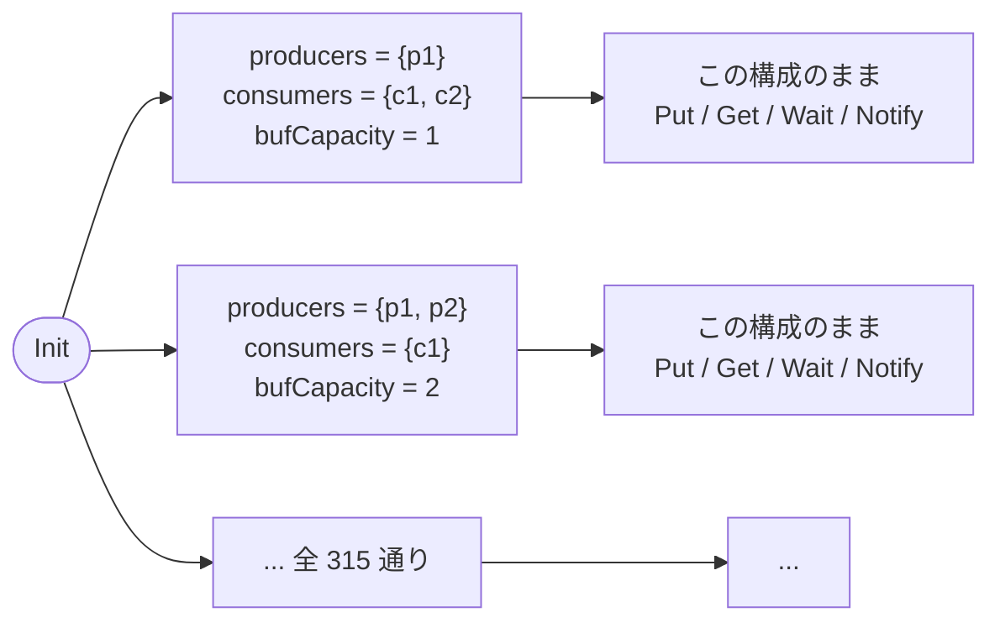

# 定数から変数へ — 一回の探索で複数の構成を扱う

出典: [learning.tlapl.us / BlockingQueue Tutorial / Constants to Variables](https://learning.tlapl.us/blocking-queue/variables/)

02〜05 章では、構成（producer 数・consumer 数・容量）を `CONSTANTS` で固定し、**p1c1b1 / p1c2b1 / p2c1b1** と
`.cfg` を書き分けて一つずつ検査してきました。この方法では「試した構成」しか分かりません。この章では
構成そのものを**変数**にし、`Init` に選ばせます。TLC は 1 回の実行で 315 通りの構成をまとめて探索します。

前のページ: [examples/02-blocking-queue-tutorial/05-safety](../05-safety)（デッドロックの安全性）

---

## 1. 変えるのは「構成の与え方」だけ

`Put`、`Get`、`Wait`、`Notify` の中身は 01〜05 章と同じです。変わるのは、構成を**どこから受け取るか**です。

```diff
-VARIABLES buffer, waitSet
+VARIABLES buffer, waitSet, producers, consumers, bufCapacity

-vars == <<buffer, waitSet>>
+vars == <<buffer, waitSet, producers, consumers, bufCapacity>>
+config == <<producers, consumers, bufCapacity>>

 RunningThreads ==
-    (Producers \cup Consumers) \ waitSet
+    (producers \cup consumers) \ waitSet

 Init ==
     /\ buffer = <<>>
     /\ waitSet = {}
+    /\ producers \in (SUBSET Producers) \ {{}}
+    /\ consumers \in (SUBSET Consumers) \ {{}}
+    /\ bufCapacity \in 1..BufCapacity

 Next ==
-    \E thread \in RunningThreads :
-        \/ ...
+    /\ \E thread \in RunningThreads :
+           \/ ...
+    /\ UNCHANGED config
```

大文字と小文字の使い分けが、この章の要点です。

| 名前 | 種類 | 意味 |
| --- | --- | --- |
| `Producers` / `Consumers` / `BufCapacity` | `CONSTANTS` | **選べる範囲の上限**。`.cfg` で与える |
| `producers` / `consumers` / `bufCapacity` | `VARIABLES` | **この振る舞いで実際に使う構成**。`Init` が選ぶ |

`Len(buffer) < BufCapacity` などの参照もすべて小文字側に置き換わります（[BlockingQueue.tla](BlockingQueue.tla)）。
`NoDeadlock` も同様です。

```tla
NoDeadlock ==
    waitSet # (producers \cup consumers)
```

このディレクトリのファイルは次のとおりです。

| ファイル | 役割 |
| --- | --- |
| [BlockingQueue.tla](BlockingQueue.tla) | 構成を変数にした仕様 |
| [BlockingQueue.cfg](BlockingQueue.cfg) | 上流教材と同じ上限。producer 4、consumer 3、容量 3 |
| [BlockingQueueSmall.cfg](BlockingQueueSmall.cfg) | 手で数えられる上限。producer 2、consumer 2、容量 2 |

---

## 2. `Next` が構成を変えないことが本質

`Init` が構成を選び、`Next` は `UNCHANGED config` でそれを固定します。したがって**一つの振る舞いは、
一つの構成のまま最後まで進みます**。実行中に producer が増えたり容量が変わったりするシステムを
モデル化したわけではありません。



状態グラフとしては、構成ごとの独立した部分グラフが 315 個あり、初期状態だけがそれらの入口になっている
形です。これは「構成をパラメータとする無限個の仕様」を検査したのではなく、**上限以下の有限個の構成を
一度に検査した**にすぎない点に注意してください。`Producers` を 4 個にしたなら、言えるのは producer が
4 人以下の場合についてだけです。

初期状態の個数は上限から決まります。

```text
(2^4 - 1) * (2^3 - 1) * 3 = 15 * 7 * 3 = 315
```

`SUBSET Producers` は冪集合なので 2^4 = 16 通り、そこから空集合を除いて 15 通りです。空集合を除くのは、
`ASSUME Assumption` が `Producers # {}` を要求しているのと同じ理由です（producer が 0 人の構成は
このモデルの対象外）。

---

## 3. 実行する

```bash
cd examples/02-blocking-queue-tutorial/06-variables
java -cp "$(ls -d ~/.vscode/extensions/tlaplus.vscode-ide-*/tools/tla2tools.jar | tail -1)" \
  tlc2.TLC -workers 1 -config BlockingQueue.cfg BlockingQueue.tla
```

```text
Finished computing initial states: 315 distinct states generated
Error: Invariant NoDeadlock is violated.
Error: The behavior up to this point is:
State 1: <Initial predicate>
/\ producers = {p1}
/\ buffer = <<>>
/\ waitSet = {}
/\ bufCapacity = 1
/\ consumers = {c1, c2}
...
State 8: <Next line 71, col 5 to line 76, col 23 of module BlockingQueue>
/\ producers = {p1}
/\ buffer = <<>>
/\ waitSet = {p1, c1, c2}
/\ bufCapacity = 1
/\ consumers = {c1, c2}

107535 states generated, 30497 distinct states found, 6315 states left on queue.
The depth of the complete state graph search is 8.
```

反例として出てくるのは、**05 章とまったく同じ p1c2b1 の 8 状態**です。今回は `.cfg` でその構成を指定して
いません。TLC が 315 通りの中からデッドロックする構成を見つけ出しました。ここがこの章の成果です。
構成を手で列挙する作業が、探索に置き換わりました。

---

## 4. `-continue` で「どの構成が壊れるか」を調べる

既定では最初の違反で止まるため、他の構成については何も分かりません。上流教材と同じく `-continue` を
付けて、違反を報告しながら探索を最後まで続けます。`-deadlock` は TLC の既定のデッドロック検出を切る
オプションで、`CHECK_DEADLOCK FALSE` と同じ役割です（`.cfg` で切っているため、ここでは付けなくても
同じ結果になります）。

```bash
java -cp "$(ls -d ~/.vscode/extensions/tlaplus.vscode-ide-*/tools/tla2tools.jar | tail -1)" \
  tlc2.TLC -workers 1 -deadlock -continue -config BlockingQueue.cfg BlockingQueue.tla
```

| 実行 | 初期状態 | 生成状態数 | 異なる状態数 | キュー残 | 深さ |
| --- | ---: | ---: | ---: | ---: | ---: |
| 既定（最初の違反で停止） | 315 | 107,535 | 30,497 | 6,315 | 8 |
| `-continue`（全探索） | 315 | 294,258 | **57,254** | 0 | 47 |

違反した状態の `producers` / `consumers` / `bufCapacity` を集計すると、構成の大きさごとに次のように
分かれます（`X` が `NoDeadlock` 違反あり、`.` が違反なし）。

| 構成 | `bufCapacity = 1` | `bufCapacity = 2` | `bufCapacity = 3` |
| --- | :---: | :---: | :---: |
| producer 1 / consumer 1 | . | . | . |
| producer 1 / consumer 2 | X | . | . |
| producer 1 / consumer 3 | X | . | . |
| producer 2 / consumer 1 | X | . | . |
| producer 2 / consumer 2 | X | . | . |
| producer 2 / consumer 3 | X | X | . |
| producer 3 / consumer 1 | X | . | . |
| producer 3 / consumer 2 | X | X | . |
| producer 3 / consumer 3 | X | X | . |
| producer 4 / consumer 1 | X | X | . |
| producer 4 / consumer 2 | X | X | . |
| producer 4 / consumer 3 | X | X | X |

02 章の p1c1b1 が安全だったのは偶然ではなく、この表の左上に当たります。表を眺めると
「producer 数 + consumer 数 <= 2 × 容量 なら違反が出ない」という規則が見えます。**ただしこれは、
この上限までの有限個の構成を見て立てた予想です。**規則として書き下し、検査し、なぜそうなるかを説明する
作業は 08 章（デッドロック条件）で行います。今の段階で言えるのは、手で選んだ 3 構成では気づけなかった
規則性が、構成を変数にしたことで見えるようになった、ということです。

---

## 5. 小さい上限で確かめる

57,254 状態は、目で追うには大きすぎます。仕組みを確かめるには上限を下げた
[BlockingQueueSmall.cfg](BlockingQueueSmall.cfg)（producer 2 / consumer 2 / 容量 2、初期状態 18 個）を使います。

```bash
java -cp "$(ls -d ~/.vscode/extensions/tlaplus.vscode-ide-*/tools/tla2tools.jar | tail -1)" \
  tlc2.TLC -workers 1 -continue -config BlockingQueueSmall.cfg BlockingQueue.tla
```

| 実行 | 初期状態 | 生成状態数 | 異なる状態数 | キュー残 | 深さ |
| --- | ---: | ---: | ---: | ---: | ---: |
| 既定 | 18 | 547 | 228 | 10 | 8 |
| `-continue` | 18 | 584 | 252 | 0 | 10 |

違反するのは `bufCapacity = 1` の 3 構成（p1c2b1、p2c1b1、p2c2b1）だけです。前者 2 つは 03 章と 04 章で
`.cfg` を書き分けて検査したものと同じ構成で、反例の長さも一致します（p1c2b1 は 8 状態、p2c1b1 は 9 状態）。
`producers = {p2}, consumers = {c1, c2}` のように、03 章では名前が違うだけの構成も別々に探索されています。
この重複が 07 章の `SYMMETRY` の出発点です。

---

## 6. 代償と限界

構成を変数にすると、次の代償を払います。

- **状態数が増える。** 03 章の p1c2b1 は 14 状態でした。315 構成をまとめると 57,254 状態です。
  構成の集合を広げるコストは掛け算で効きます。
- **状態に構成が含まれる。** `producers = {p1}` と `producers = {p2}` は TLC にとって別の状態です。
  振る舞いとしては ID を付け替えただけの同じものなので、無駄な探索が起きています。この重複を
  除くのが 07 章の `SYMMETRY` です。
- **有限の上限までしか言えない。** producer 5 人、容量 4 について検査したことにはなりません。
  「すべての n で成り立つ」を示したければ、モデル検査ではなく証明（TLAPS）の領域になります。

一方、得られるものは明確です。**自分が試そうと思いつかなかった構成を検査できる**こと、そして
構成に対する規則性が反例の分布として現れることです。

---

## 7. 触って確かめる

1. `BufCapacity = 4`、`Producers` を 5 個に増やして `-continue` で走らせ、状態数と実行時間が
   どれだけ増えるか記録する。表の予想（producer 数 + consumer 数 <= 2 × 容量）が保たれるか確かめる。
2. `Init` の `bufCapacity \in 1..BufCapacity` を `bufCapacity = BufCapacity` に変え、違反が消えるか
   どうかを予想してから実行する。
3. `Next` から `/\ UNCHANGED config` を外して実行し、TLC が何を報告するか確かめる（次状態で値が
   決まらない変数があるとどうなるか）。そのうえで、`UNCHANGED` の代わりに
   `bufCapacity' \in 1..BufCapacity` のように毎ステップ選び直させたら、どんなシステムを
   モデル化したことになるかを説明する。
4. `Init` から `\ {{}}` を外し、`producers` に空集合を許して実行する。`RunningThreads` が空になる構成が
   `NoDeadlock` 違反として報告されるか、`ASSUME` と `Init` の役割の違いとあわせて説明する。
5. `TypeOK` の `producers \in (SUBSET Producers) \ {{}}` を消して実行し、結果が変わらないことを確認する。
   そのうえで、構成が変数になった今なぜこの行を書く価値があるかを考える。

---

## 次に読むもの

- [対称性集合](../07-symmetry) — ID の置換を同一視して状態を減らす（[上流ページ](https://learning.tlapl.us/blocking-queue/symmetry/)）
- [デッドロックの安全性](../05-safety) — この章の反例と同じ 8 状態を、固定構成で読む
- [構成を大きくする](../03-larger-config) — `.cfg` を書き分けていた頃のやり方を復習する

## 参考資料

- [BlockingQueue Tutorial / Constants to Variables](https://learning.tlapl.us/blocking-queue/variables/)
- [TLC Model Checker](https://docs.tlapl.us/using:tlc:start) — `-continue` と `-deadlock`
- [lemmy/BlockingQueue の対応リビジョン](https://github.com/lemmy/BlockingQueue) — MIT License（[ライセンス表示](LICENSE.upstream)）
