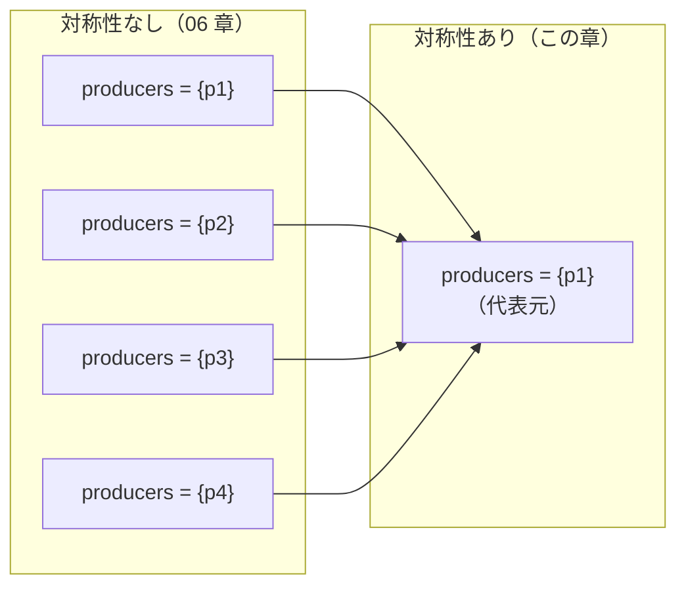

# 対称性集合 — ID の置換を同一視して状態を減らす

出典: [learning.tlapl.us / BlockingQueue Tutorial / Symmetry Sets](https://learning.tlapl.us/blocking-queue/symmetry/)

06 章で構成を変数にした結果、1 回の実行で 315 通りの構成を検査できるようになりました。同時に、
`producers = {p1}` と `producers = {p2}` のように**名前が違うだけの状態**を TLC が別々に数えている、という
無駄も見えました。この章では `SYMMETRY` を宣言してその重複を取り除きます。全探索の状態数は
**57,254 から 1,647 へ、約 35 分の 1** に減ります。仕様は一行も変えません。

前のページ: [examples/02-blocking-queue-tutorial/06-variables](../06-variables)（定数から変数へ）

---

## 1. 対称性とは何か

上流教材の定義はこうです。

> An expression is symmetric for a set S if and only if interchanging any two values of S does not change
> the value of the expression.
> （式が集合 S について対称であるとは、S の任意の 2 つの値を入れ替えても式の値が変わらないことをいう）

`BlockingQueue` でいえば、producer の名前 `p1` と `p2` を全面的に入れ替えても、`Init`、`Next`、`TypeOK`、
`CapacityOK`、`NoDeadlock` のどれも値が変わりません。どの producer も同じ振る舞いをするからです。
consumer についても同じです。

したがって次の 2 状態は、TLA+ の式から見て区別がつきません。

```text
producers = {p1},  waitSet = {p1, c1, c2}    ← 06 章が報告した反例の最終状態
producers = {p2},  waitSet = {p2, c1, c2}    ← p1 と p2 を入れ替えただけ
```

06 章の TLC はこれを 2 状態として数えていました。`SYMMETRY` は「この 2 つは同じものとして 1 回だけ
探索してよい」と TLC に伝える宣言です。



TLC は同値類ごとに**代表元を 1 つだけ**保持し、残りは「既に見た状態」として捨てます。

---

## 2. 変えるのは宣言だけ

仕様側の差分は `EXTENDS` の 1 語と定義 1 個だけです。`Init`、`Next`、不変条件には手を触れません。

```diff
-EXTENDS Naturals, Sequences, FiniteSets
+EXTENDS Naturals, Sequences, FiniteSets, TLC

+Symmetry ==
+    Permutations(Producers) \cup Permutations(Consumers)
```

`Permutations(S)` は `TLC` モジュールの演算子で、S の要素同士を入れ替える全単射の集合を返します。
`Producers` の置換と `Consumers` の置換を合わせて渡すことで、「producer 同士は入れ替えてよい、
consumer 同士も入れ替えてよい」と宣言したことになります。producer と consumer を**またいだ**入れ替えは
含みません（両者は別の役割なので、入れ替えたら `Next` の意味が変わってしまいます）。

`.cfg` 側は 1 行の追加です。

```diff
 CONSTANTS
     BufCapacity = 3
     Producers = {p1, p2, p3, p4}
     Consumers = {c1, c2, c3}

+SYMMETRY Symmetry
+
 INIT Init
 NEXT Next
```

`Producers` と `Consumers` に与えているのが**モデル値**（`p1` のような、TLC が「互いに異なる」以外の
性質を持たない値）であることが前提です。整数を与えていたら `1 < 2` のような式が成り立ってしまい、
置換で値が変わるため対称性は使えません。

このディレクトリのファイルは次のとおりです。

| ファイル | 役割 |
| --- | --- |
| [BlockingQueue.tla](BlockingQueue.tla) | 06 章の仕様に `Symmetry` を足しただけ |
| [BlockingQueue.cfg](BlockingQueue.cfg) | `SYMMETRY` あり。producer 4 / consumer 3 / 容量 3 |
| [BlockingQueueNoSymmetry.cfg](BlockingQueueNoSymmetry.cfg) | 比較用。`SYMMETRY` 行だけを外した 06 章と同じ検査 |
| [BlockingQueueSmall.cfg](BlockingQueueSmall.cfg) | 手で数えられる上限。producer 2 / consumer 2 / 容量 2 |
| [BlockingQueueUnsound.cfg](BlockingQueueUnsound.cfg) | 6 節用。対称でない不変条件を `SYMMETRY` ありで検査する |
| [BlockingQueueUnsoundNoSymmetry.cfg](BlockingQueueUnsoundNoSymmetry.cfg) | 6 節用。同じ検査から `SYMMETRY` を外した版 |

---

## 3. 実行して差を測る

```bash
cd examples/02-blocking-queue-tutorial/07-symmetry
java -cp "$(ls -d ~/.vscode/extensions/tlaplus.vscode-ide-*/tools/tla2tools.jar | tail -1)" \
  tlc2.TLC -workers 1 -config BlockingQueue.cfg BlockingQueue.tla
```

```text
Finished computing initial states: 315 states generated, with 36 of them distinct
Error: Invariant NoDeadlock is violated.
Error: The behavior up to this point is:
State 1: <Initial predicate>
/\ producers = {p1}
/\ buffer = <<>>
/\ waitSet = {}
/\ bufCapacity = 1
/\ consumers = {c1, c2}
...
State 8: <Next line 60, col 5 to line 65, col 23 of module BlockingQueue>
/\ producers = {p1}
/\ buffer = <<>>
/\ waitSet = {p1, c1, c2}
/\ bufCapacity = 1
/\ consumers = {c1, c2}

3842 states generated, 906 distinct states found, 167 states left on queue.
The depth of the complete state graph search is 8.
```

まず初期状態の行が変わっています。06 章は `315 distinct states generated` でしたが、今回は
`315 states generated, with 36 of them distinct` です。315 個を生成してから同値類にまとめ、**36 個**が
残りました。36 は「producer の人数 4 通り × consumer の人数 3 通り × 容量 3 通り」です。
**どの ID を選んだかは意味を持たず、何人かだけが意味を持つ**という理解が、そのまま数に現れています。

```text
対称性なし: (2^4 - 1) * (2^3 - 1) * 3 = 15 * 7 * 3 = 315
対称性あり:  4 * 3 * 3 = 36
```

`-deadlock -continue` で最後まで探索したときの差が本題です。

```bash
java -cp "$(ls -d ~/.vscode/extensions/tlaplus.vscode-ide-*/tools/tla2tools.jar | tail -1)" \
  tlc2.TLC -workers 1 -deadlock -continue -config BlockingQueue.cfg BlockingQueue.tla

java -cp "$(ls -d ~/.vscode/extensions/tlaplus.vscode-ide-*/tools/tla2tools.jar | tail -1)" \
  tlc2.TLC -workers 1 -deadlock -continue -config BlockingQueueNoSymmetry.cfg BlockingQueue.tla
```

| 実行 | 初期状態（異なる） | 生成状態数 | 異なる状態数 | 深さ | 違反報告 |
| --- | ---: | ---: | ---: | ---: | ---: |
| 06 章と同じ（`SYMMETRY` なし） | 315 | 294,258 | **57,254** | 47 | 587 |
| この章（`SYMMETRY` あり） | 36 | 8,955 | **1,647** | 47 | 35 |

最初の違反で止める既定の実行でも同じ傾向です。

| 実行 | 生成状態数 | 異なる状態数 | キュー残 | 深さ |
| --- | ---: | ---: | ---: | ---: |
| `SYMMETRY` なし | 107,535 | 30,497 | 6,315 | 8 |
| `SYMMETRY` あり | 3,842 | 906 | 167 | 8 |

注目すべきは、**深さ 47 と反例の長さ 8 が変わっていない**ことです。対称性は状態グラフを畳みますが、
振る舞いの長さを縮めるわけではありません。減るのは「同じ形をした別名の状態」だけです。

---

## 4. 結論は変わらない — 違反する構成は同じ 18 通り

対称性を使うと結果が変わるのではないか、という不安に答えておきます。`-continue` の出力から違反した
構成を集計すると、次のようになります。

| | `SYMMETRY` なし | `SYMMETRY` あり |
| --- | ---: | ---: |
| 違反の報告回数 | 587 | 35 |
| 違反した具体的な構成（ID 込み） | 123 | 18 |
| 違反した構成の**形**（人数と容量） | **18** | **18** |

形で数えると完全に一致します。06 章の表がそのまま再現されます（`X` が `NoDeadlock` 違反あり）。

| 構成 | `bufCapacity = 1` | `bufCapacity = 2` | `bufCapacity = 3` |
| --- | :---: | :---: | :---: |
| producer 1 / consumer 1 | . | . | . |
| producer 1 / consumer 2 | X | . | . |
| producer 1 / consumer 3 | X | . | . |
| producer 2 / consumer 1 | X | . | . |
| producer 2 / consumer 2 | X | . | . |
| producer 2 / consumer 3 | X | X | . |
| producer 3 / consumer 1 | X | . | . |
| producer 3 / consumer 2 | X | X | . |
| producer 3 / consumer 3 | X | X | . |
| producer 4 / consumer 1 | X | X | . |
| producer 4 / consumer 2 | X | X | . |
| producer 4 / consumer 3 | X | X | X |

違いは、`SYMMETRY` ありでは違反する構成の `producers` がつねに `{p1}`、`{p1, p2}`、`{p1, p2, p3}`、
`{p1, p2, p3, p4}` という**代表元だけ**になることです。06 章で見た
「`producers = {p2}, consumers = {c1, c2}` は `producers = {p1}, consumers = {c1, c2}` と同じ話」という
重複が、探索の段階で消えています。

「producer 数 + consumer 数 <= 2 × 容量 なら違反が出ない」という 06 章の予想も、そのまま残っています。
この予想を規則として書き下し、検査するのが次の 08 章です。

---

## 5. 小さい上限で数えて納得する

1,647 状態でもまだ目で追うには多いので、[BlockingQueueSmall.cfg](BlockingQueueSmall.cfg)
（producer 2 / consumer 2 / 容量 2）で数を確かめます。

```bash
java -cp "$(ls -d ~/.vscode/extensions/tlaplus.vscode-ide-*/tools/tla2tools.jar | tail -1)" \
  tlc2.TLC -workers 1 -continue -config BlockingQueueSmall.cfg BlockingQueue.tla
```

| 実行 | 初期状態（異なる） | 生成状態数 | 異なる状態数 | 深さ | 違反報告 |
| --- | ---: | ---: | ---: | ---: | ---: |
| `SYMMETRY` なし（06 章） | 18 | 584 | 252 | 10 | 9 |
| `SYMMETRY` あり | 8 | 225 | 87 | 10 | 4 |

初期状態が 18 個から 8 個になりました。手で確かめられます。

```text
対称性なし: (2^2 - 1) * (2^2 - 1) * 2 = 3 * 3 * 2 = 18
対称性あり:  2 * 2 * 2 = 8      （producer 1〜2 人 × consumer 1〜2 人 × 容量 1〜2）
```

消えた 10 個は `producers = {p2}`、`consumers = {c2}` のように、代表元と人数が同じで名前だけ違うものです。
違反する構成も、形でみれば `SYMMETRY` の有無によらず `bufCapacity = 1` の 3 通り
（producer 1 / consumer 2、producer 2 / consumer 1、producer 2 / consumer 2）のままです。

---

## 6. 不健全な宣言は違反を隠す — 実際に隠してみる

上流教材の警告はこれです。

> TLC does not verify that your symmetry declaration is sound. An incorrect declaration can hide errors.
> （TLC は対称性の宣言が健全かどうかを検査しない。誤った宣言はエラーを隠しうる）

この「隠す」は比喩ではありません。[BlockingQueue.tla](BlockingQueue.tla) の末尾に、実演のためだけの定義を
置いてあります。仕様の性質ではないので、読み終えたら忘れてかまいません。

```tla
ChosenProducer == CHOOSE p \in Producers : TRUE
SecondProducer == CHOOSE p \in Producers : p # ChosenProducer

NotSoleChosen == producers # {ChosenProducer}
NotSoleSecond == producers # {SecondProducer}
```

`CHOOSE` は `Producers` の要素を**個別に名指し**します。名指しした瞬間、その式は producer の置換で
値が変わります。つまり `Symmetry` について対称ではありません。宣言が仕様に対して正しくても、
**検査する性質の側が対称でなければ結果は信用できない**、というのがここでの論点です。

`SYMMETRY` を外して検査すると、初期状態で違反が出ます。`Init` は `producers` に
`{p1}`、`{p2}`、`{p3}`、`{p4}`、… をすべて選ばせるので、当然です。

```bash
java -cp "$(ls -d ~/.vscode/extensions/tlaplus.vscode-ide-*/tools/tla2tools.jar | tail -1)" \
  tlc2.TLC -workers 1 -config BlockingQueueUnsoundNoSymmetry.cfg BlockingQueue.tla
```

```text
Error: Invariant NotSoleSecond is violated by the initial state:
/\ producers = {p2}
/\ buffer = <<>>
/\ waitSet = {}
/\ bufCapacity = 1
/\ consumers = {c1}
```

同じ不変条件を `SYMMETRY` ありで検査すると、違反は報告されません。

```bash
java -cp "$(ls -d ~/.vscode/extensions/tlaplus.vscode-ide-*/tools/tla2tools.jar | tail -1)" \
  tlc2.TLC -workers 1 -config BlockingQueueUnsound.cfg BlockingQueue.tla
```

```text
Model checking completed. No error has been found.
8955 states generated, 1647 distinct states found, 0 states left on queue.
```

理由は 1 節の図のとおりです。`{p1}`、`{p2}`、`{p3}`、`{p4}` は 1 つの同値類に畳まれ、TLC は代表元
（この環境では `{p1}`）だけを訪れます。`producers = {p2}` という状態はそもそも探索されないので、
`NotSoleSecond` はそこで評価されません。**警告も出ません。**「検査した、問題なかった」という
出力だけが残ります。これが「エラーを隠す」の具体的な意味です。

なお `CHOOSE` がどの ID を選ぶかは TLA+ の意味論では決まっていません。この環境では
`ChosenProducer = p1`、`SecondProducer = p2` となるため、`NotSoleChosen` のほうは `SYMMETRY` ありでも
違反が報告されます。**同じ種類の性質なのに、片方は報告され、片方は隠れる。**どちらが報告されるかが
代表元の選ばれ方という仕様外の事情で決まってしまう時点で、この検査結果には意味がありません。

---

## 7. `SYMMETRY` を使ってよい条件

以上をまとめると、`SYMMETRY S` を宣言してよいのは次がすべて成り立つときです。

1. `S` に与える定数が**モデル値**である（整数や文字列のように、要素間に順序や構造があってはならない）
2. **仕様**（`Init`、`Next`、および `Spec`）が `S` の置換で不変である
3. **検査するすべての性質**（不変条件、`ASSUME`、`PROPERTY`）が `S` の置換で不変である
4. 検査するのが**安全性**である

4 番目は上流教材が別途注意している点です。

> Note that symmetry sets should not be used when checking liveness properties.
> （ライブネス性質を検査するときに対称性集合を使ってはならない）

TLC が対称性のもとで行うライブネス検査は健全ではなく、存在しない反例を報告したり、実在する
反例を見逃したりします。03 フェーズで `WF_vars` や `<>P` を扱うときには、`SYMMETRY` を外すか、
安全性の検査と分けて実行することになります。

この章の `BlockingQueue` は 1〜4 をすべて満たします。3 について具体的に確かめるなら、
`TypeOK`、`CapacityOK`、`NoDeadlock` のどれもが「集合の要素数」「集合同士の等号・包含」しか使っておらず、
特定の ID を名指ししていないことを見てください。6 節の `NotSoleSecond` との違いはそこだけです。

---

## 8. 代償と限界

- **健全性の責任は書き手にある。** 状態数が減るのは検査を間引いているからです。間引いてよい根拠
  （1〜4 の条件）は人間が示すもので、TLC は確認しません。この点で `SYMMETRY` は、定数を小さくする
  ような「範囲を狭めたと分かる」削減とは性質が違います。**減ったのに気づけない**のが危険です。
- **削減量は問題に依存する。** ここでは 35 分の 1 になりましたが、対称な ID が少ない仕様では
  ほとんど効きません。逆に、n 個の対称なプロセスがあるモデルでは最大 n! 分の 1 まで効きます。
- **反例が読みにくくなることがある。** TLC が返すのは代表元の振る舞いなので、自分が想定していた
  ID の組み合わせと違う形で出てくる場合があります。意味は同じですが、実装のログと突き合わせる
  ときには置換を頭の中で戻す必要があります。
- **状態が減っても、状態の中身は減らない。** `buffer` の中身のように、性質にとって不要な情報は
  そのまま残っています。それを捨てる仕組みが 09 章の `VIEW` です。`SYMMETRY` と `VIEW` は
  「同じ状態とみなす条件を人間が与える」という点で同じ系統の道具です。

---

## 9. 触って確かめる

1. `Symmetry` を `Permutations(Producers)` だけにして `-continue` で走らせ、状態数が
   1,647 と 57,254 の間のどこに来るか予想してから実行する。
2. `Symmetry` を `Permutations(Producers \cup Consumers)` に変えて実行する。状態数はさらに減るはずだが、
   この宣言は健全か。`Next` の `thread \in producers` / `thread \in consumers` の分岐に戻って説明する
   （`Producers \intersect Consumers = {}` という `ASSUME` がなぜ効くかを考えること）。
3. `.cfg` の `Producers` を `{1, 2, 3, 4}` に変えて実行し、TLC が何を報告するか確かめる。
   モデル値でないとなぜ対称性が使えないのかを、`Seq(producers)` や `Append` に戻って説明する。
4. 6 節の `NotSoleSecond` を `NotSoleChosen` に差し替えて `BlockingQueueUnsound.cfg` を実行し、
   今度は違反が報告されることを確認する。そのうえで「報告されたから正しい検査だった」とは
   言えない理由を書く。
5. `Producers` を 5 個、`Consumers` を 4 個に増やし、`SYMMETRY` の有無で状態数と実行時間を比較する。
   削減率が 4 節の 35 分の 1 より上がるか下がるかを、初期状態の数え方から予想してから実行する。

---

## 次に読むもの

- [デッドロック条件](../08-deadlock-condition) — 4 節の表の規則性を不等式として書き下す（[上流ページ](https://learning.tlapl.us/blocking-queue/inequation/)）
- [定数から変数へ](../06-variables) — 57,254 状態の内訳と、構成を変数にした理由
- [デッドロックの安全性](../05-safety) — この章の反例と同じ 8 状態を、固定構成で読む

## 参考資料

- [BlockingQueue Tutorial / Symmetry Sets](https://learning.tlapl.us/blocking-queue/symmetry/)
- [TLC Model Checker](https://docs.tlapl.us/using:tlc:start) — `SYMMETRY`、モデル値、`Permutations`
- [Specifying Systems](https://lamport.azurewebsites.net/tla/book.html) — 14.3 節「Symmetry Sets」
- [lemmy/BlockingQueue の対応リビジョン](https://github.com/lemmy/BlockingQueue) — MIT License（[ライセンス表示](LICENSE.upstream)）
