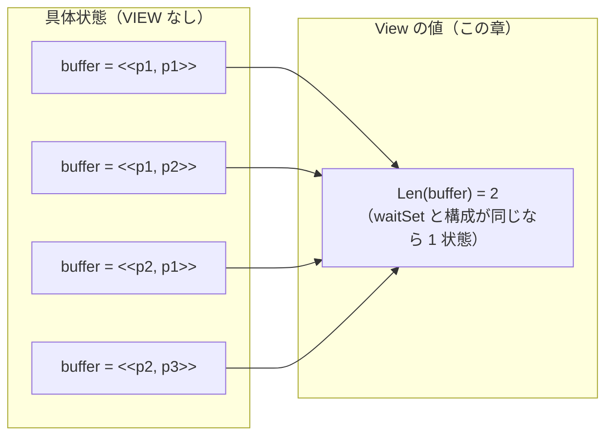

# `VIEW` による抽象化 — 性質に不要なバッファ内容を捨てる

出典: [learning.tlapl.us / BlockingQueue Tutorial / VIEW](https://learning.tlapl.us/blocking-queue/view/)

07 章の `SYMMETRY` は「名前を入れ替えただけの状態」を畳みました。この章の `VIEW` が畳むのは
**状態の中身のうち、検査する性質が見ていない部分**です。

`NoDeadlock` も `CapacityOK` も、バッファに**何が**入っているかは一度も見ていません。見ているのは
`waitSet` と `Len(buffer)` だけです。それなら `buffer = <<p1, p2>>` と `buffer = <<p1, p1>>` を
別々に探索する意味はありません。`VIEW` はその判断を TLC に伝える宣言です。

前のページ: [examples/02-blocking-queue-tutorial/08-deadlock-condition](../08-deadlock-condition)（デッドロック条件）

---

## 1. 捨てるものを決める

仕様本体（`Init`、`Next`、`Put`、`Get`、`Wait`、`Notify`）は 06 章から一行も変えていません。
足すのは射影の定義 1 個です。

```tla
View ==
    <<Len(buffer), waitSet, producers, consumers, bufCapacity>>
```

`vars` との違いは 1 か所だけです。

```diff
-vars  == <<buffer,      waitSet, producers, consumers, bufCapacity>>
+View  == <<Len(buffer), waitSet, producers, consumers, bufCapacity>>
```

`.cfg` 側は 1 行の追加です。

```diff
 SYMMETRY Symmetry
+VIEW View
```

TLC は、状態が「既に見たものかどうか」を判定するとき、状態そのものではなく `View` の値を使うように
なります。`View` が等しい 2 つの状態は同じものとして扱われ、片方だけが探索されます。



このディレクトリのファイルは次のとおりです。

| ファイル | 役割 |
| --- | --- |
| [BlockingQueue.tla](BlockingQueue.tla) | 07 章の仕様に `View` と検査用の性質を足したもの |
| [BlockingQueue.cfg](BlockingQueue.cfg) | `VIEW` + `SYMMETRY`。producer 4 / consumer 3 / 容量 3 |
| [BlockingQueueNoView.cfg](BlockingQueueNoView.cfg) | 比較用。`SYMMETRY` のみ（07 章と同じ探索） |
| [BlockingQueueViewOnly.cfg](BlockingQueueViewOnly.cfg) | 比較用。`VIEW` のみ |
| [BlockingQueuePlain.cfg](BlockingQueuePlain.cfg) | 比較用。どちらもなし（06 章と同じ探索） |
| [BlockingQueueUnsound.cfg](BlockingQueueUnsound.cfg) | 5 節用。中身に依存する性質を `VIEW` ありで検査する |
| [BlockingQueueUnsoundNoView.cfg](BlockingQueueUnsoundNoView.cfg) | 5 節用。同じ検査から `VIEW` を外した版 |

---

## 2. `SYMMETRY` との違い

どちらも「別の状態を同じものとみなしてよい」と人間が宣言する道具ですが、根拠が違います。

| | `SYMMETRY` | `VIEW` |
| --- | --- | --- |
| 何を畳むか | 値の**名前**を入れ替えた状態 | 状態を**射影**した先が同じ状態 |
| 根拠 | 仕様と性質がその置換で不変であること | 仕様と性質が捨てた部分を見ていないこと |
| 落とす情報 | どの ID を使ったか | 指定しなかった変数（ここでは `buffer` の中身） |
| 書く場所 | `Permutations(...)` の集合 | 状態から値へのタプル（射影） |
| TLC は健全性を検査するか | **しない** | **しない** |

最後の行が共通しています。どちらも、間引いてよい根拠を示す責任は書き手にあります。

---

## 3. 実行して測る

4 通りの組み合わせを `-continue` で全探索した結果です（`-continue` を付けるのは、最初の違反で止めずに
状態グラフ全体を数えるためです）。

```bash
cd examples/02-blocking-queue-tutorial/09-view
java -cp "$(ls -d ~/.vscode/extensions/tlaplus.vscode-ide-*/tools/tla2tools.jar | tail -1)" \
  tlc2.TLC -workers 1 -continue -config BlockingQueue.cfg BlockingQueue.tla
```

| 構成 | 初期状態（異なる） | 生成状態数 | 異なる状態数 | 深さ | 削減率 |
| --- | ---: | ---: | ---: | ---: | ---: |
| どちらもなし（06 章） | 315 | 294,258 | 57,254 | 47 | 1.0 倍 |
| `VIEW` のみ | 315 | 49,884 | 10,808 | 47 | 5.3 倍 |
| `SYMMETRY` のみ（07 章） | 36 | 8,955 | 1,647 | 47 | 34.8 倍 |
| **両方（この章）** | 36 | 5,726 | **1,030** | 47 | **55.6 倍** |

読みどころが 3 つあります。

**`VIEW` 単独では 5.3 倍にとどまります。** `buffer` の中身は高々 3 要素で、入るのは producer の ID なので、
組み合わせの数はもともとそれほど大きくありません。

**`SYMMETRY` の上に載せても、まだ 1.6 倍（1,647 → 1,030）効きます。** 対称性はすでに ID の違いを
畳んでいるので、残っているのは `<<p1, p1>>` と `<<p1, p2>>` のような、**個数の内訳が違う**中身の区別です。
2 つの削減は同じものを畳んでいるわけではない、ということが数に出ています。

**初期状態の数は `VIEW` では変わりません。** 初期状態はどれも `buffer = <<>>` なので、中身を捨てても
区別は減りません。`VIEW` が効くのは探索が進んでバッファに物が入ってからです。

> 上流教材はこの章の削減を「2,940 から 1,797 へ」と報告しています。ここで測った 1,647 → 1,030 と
> 数が違うのは、上流と `.cfg` の構成・前提が異なるためです。比率（おおむね 1.6 倍）はよく一致しています。

---

## 4. 反例と結論は変わらない

`VIEW` ありで既定の実行（最初の違反で停止）をすると、返ってくるのは 02〜08 章でおなじみの
**p1c2b1 の 8 状態**です。

```text
Error: Invariant NoDeadlock is violated.
State 1: <Initial predicate>
/\ producers = {p1}
/\ buffer = <<>>
/\ waitSet = {}
/\ bufCapacity = 1
/\ consumers = {c1, c2}
...
State 8:
/\ producers = {p1}
/\ buffer = <<>>
/\ waitSet = {p1, c1, c2}
/\ bufCapacity = 1
/\ consumers = {c1, c2}
```

反例に出てくるのは `Len(buffer)` ではなく `buffer` そのものです。**`VIEW` は探索の重複判定を変えるだけで、
状態そのものを抽象化するわけではありません。**TLC は具体状態を生成し、不変条件も具体状態で評価し、
反例も具体状態で報告します。変わるのは「この状態はもう見た」と判断する基準だけです。

一方、検査する性質のほうには手を入れています。07 章まで使っていた `TypeOK` を、この章では
`ShapeOK` に置き換えました。

```diff
-    /\ buffer \in Seq(producers)
+    /\ Len(buffer) \in 0..bufCapacity
```

`buffer \in Seq(producers)` は「中身がすべて `producers` の要素か」を見ています。中身を捨てると宣言した
以上、中身に依存する性質をその宣言のもとで検査するのは筋が通りません。この仕様では `TypeOK` は
実際に成り立つので見逃しは起きませんが、**成り立つかどうかは結果論**です。`VIEW` を入れたら、
検査する性質の側も「捨てた部分を見ていないか」を一つずつ確認する、という順序で考えます。

---

## 5. 不健全な `VIEW` は違反を隠す

上流教材の注意はこうです。

> A view is not automatically safe for every property.
> （ビューはあらゆる性質にとって自動的に安全なわけではない）

07 章の `SYMMETRY` と同じく、これは実演できます。[BlockingQueue.tla](BlockingQueue.tla) に、
中身に依存する性質を 1 つ置いてあります。

```tla
NotThreeDistinct ==
    ~ /\ Len(buffer) = 3
      /\ buffer[1] # buffer[2]
      /\ buffer[1] # buffer[3]
      /\ buffer[2] # buffer[3]
```

「異なる 3 者のデータが同時にバッファに並ぶことはない」という主張です。もちろん偽で、`VIEW` を
外せば 4 状態で反証されます。

```bash
java -cp "$(ls -d ~/.vscode/extensions/tlaplus.vscode-ide-*/tools/tla2tools.jar | tail -1)" \
  tlc2.TLC -workers 1 -config BlockingQueueUnsoundNoView.cfg BlockingQueue.tla
```

```text
Error: Invariant NotThreeDistinct is violated.
State 1: buffer = <<>>            producers = {p1, p2, p3}, bufCapacity = 3
State 2: buffer = <<p1>>
State 3: buffer = <<p1, p2>>
State 4: buffer = <<p1, p2, p3>>
```

同じ検査に `VIEW View` を足すと、違反は報告されません。

```bash
java -cp "$(ls -d ~/.vscode/extensions/tlaplus.vscode-ide-*/tools/tla2tools.jar | tail -1)" \
  tlc2.TLC -workers 1 -config BlockingQueueUnsound.cfg BlockingQueue.tla
```

```text
Model checking completed. No error has been found.
49884 states generated, 10808 distinct states found, 0 states left on queue.
```

`0 states left on queue` が付いていることに注意してください。**探索は途中で諦めたのではなく、
最後まで走りきったうえで「問題なし」と言っています。**

### なぜ隠れるのか

急所は、**`View` で見て既出の状態は、不変条件を評価されないまま捨てられる**ことです。捨てられた
状態は展開もされないので、その先にしかない違反には永久に到達しません。上の反例でいえば
状態 3 がそれに当たります。

```text
State 2: buffer = <<p1>>      ← View = <<1, {}, ...>>
  ├─ 後続: buffer = <<p1, p1>>   View = <<2, {}, ...>>   ← 先に生成され、代表元として残る
  └─ 後続: buffer = <<p1, p2>>   View = <<2, {}, ...>>   ← 既出とみなされ、検査も展開もされない
                                    └─ その後続 <<p1, p2, p3>> は生成すらされない
```

「評価されないまま捨てられる」ことは、極端な `View` を使えば直接確かめられます。`View` から
`Len(buffer)` ごと落として `<<waitSet, producers, consumers, bufCapacity>>` にし、明らかに偽の不変条件
`AlwaysEmpty == Len(buffer) = 0` を検査すると、TLC は `No error has been found` と答えます。
初期状態から producer が 1 つ入れた状態（`buffer = <<p1>>`、`waitSet = {}`）は確かに生成されますが、
初期状態と `View` が同じなので、検査されずに捨てられているのです。

一方、「同じ producer のデータが 2 つ並ぶことはない」という（これも偽の）主張
`NoDuplicateInBuffer` は、`VIEW` を付けても違反が報告されます。違反する状態 `<<p1, p1>>` のほうが
先に生成され、代表元として残るからです。

| 性質 | `VIEW` なし | `VIEW` あり |
| --- | --- | --- |
| `NoDuplicateInBuffer`（深さ 2 で違反） | 違反 | 違反 |
| `NotThreeDistinct`（深さ 3 で違反） | 違反 | **報告されない** |

**見つかることもある。しかしそれは健全性の保証ではありません。**どちらが見つかるかは、TLC が
どの状態を先に生成したかという、仕様の外側の事情で決まっています。実際、この `NotThreeDistinct` は
`VIEW` と `SYMMETRY` を**両方**付けると、対称性側の代表元の取り方が変わるせいで、また違反として
報告されるようになります。結果が道具の組み合わせで変わる時点で、その検査は信用できません。

---

## 6. `VIEW` を使ってよい条件

1. **検査するすべての性質**が、`View` に載せなかった部分を読んでいないこと
2. `View` が等しい状態同士は、**同じ遷移が可能**であること（後続の「形」が一致すること）
3. 検査するのが**安全性**であること

2 番目がこの章の仕様で成り立つ理由は、`Next` を読めば分かります。`Put` の条件は
`Len(buffer) < bufCapacity` と `Len(buffer) = bufCapacity`、`Get` の条件は `buffer # <<>>` と
`buffer = <<>>`。どれも長さしか見ていません。だから長さが同じ 2 状態は、同じ行動が同じだけ可能です。
5 節の `NotThreeDistinct` が破綻したのは 2 番目ではなく 1 番目の条件のほうです。

3 番目は `SYMMETRY` と同じ理由です。ライブネスの検査では、状態を畳むと無限の振る舞いの扱いが
変わるため、`VIEW` は使えません。03 フェーズで `<>P` や `WF_vars` を扱うときには外します。

---

## 7. 代償と限界

- **効き方は仕様の形に依存する。** ここでは 5.3 倍でした。`buffer` に入るのが producer の ID ではなく
  実データ（例えば `1..1000` の整数）だったら、`VIEW` の削減率は桁違いに大きくなります。
  **何を捨てると効くかは、状態のどこに組み合わせ爆発があるかで決まります。**
- **状態数は減るが、状態の生成は減らない。** 生成状態数 49,884 に対して異なる状態は 10,808 です。
  TLC は具体状態を作ってから View を計算して捨てています。メモリは減っても、計算はその分だけ減りません。
- **見逃しに気づけない。** 5 節のとおり、出力は `No error has been found` です。範囲を狭めたと分かる
  削減（定数を小さくする）と違い、**間引いたこと自体が出力に現れません**。
- **性質を足すたびに再確認が要る。** 後から不変条件を 1 つ足したとき、それが捨てた部分を見ていないかを
  確認する手順を忘れると、その瞬間に検査が意味を失います。`VIEW` は `.cfg` に 1 行書いたきり
  忘れられやすい宣言なので、この点は実務でとくに効きます。

---

## 8. 触って確かめる

1. `View` から `waitSet` を落として `<<Len(buffer), producers, consumers, bufCapacity>>` にして実行する。
   状態数はどこまで減るか、`NoDeadlock` の違反はまだ報告されるかを予想してから走らせ、
   なぜそうなるかを `NoDeadlock` の定義に戻って説明する。
2. `View` を `<<Len(buffer), Cardinality(waitSet), producers, consumers, bufCapacity>>` に変える
   （待機集合を人数だけに潰す）。状態数と、`NoDeadlock` 違反の有無を確認し、6 節の条件 1 と 2 の
   どちらが破れているかを判定する。
3. `BlockingQueueUnsound.cfg` に `SYMMETRY Symmetry` を足して実行し、5 節末尾のとおり違反が
   また報告されることを確かめる。「道具を足したら違反が見つかった」という出来事を、
   健全性の言葉で説明する。
4. `ShapeOK` を `TypeOK` に戻して `VIEW` ありで実行し、報告されるのが `NoDeadlock` 違反だけで
   `TypeOK` は破られないことを確認する。そのうえで、
   それでもこの組み合わせを避けるべき理由を 4 節の言葉で書く。
5. `Put(thread, data)` の呼び出しを `Put(thread, thread)` から `Put(thread, 1)` に変え
   （全 producer が同じデータを入れる）、`VIEW` なしの状態数が 57,254 からどれだけ減るかを測る。
   `VIEW` による削減と、**仕様側で情報を捨てる**ことの違いを説明する。
6. 08 章の `LogDeadlock`（`PrintT` による集計）をこの章の `VIEW` ありで走らせ、印字される
   `<<"InvVio", 容量, スレッド総数>>` の組が 9 通りのまま変わらないことを確かめる。

---

## 次に読むもの

- [BlockingQueue Tutorial / Nondeterministic Notify](https://learning.tlapl.us/blocking-queue/nondeterminism/) — 実装が許す選択を漏れなくモデル化する
- [対称性集合](../07-symmetry) — もう一つの「畳んでよい」宣言
- [デッドロック条件](../08-deadlock-condition) — この章の削減の上で回した検査

## 参考資料

- [BlockingQueue Tutorial / VIEW](https://learning.tlapl.us/blocking-queue/view/)
- [TLC Model Checker](https://docs.tlapl.us/using:tlc:start) — `VIEW` と `SYMMETRY`
- [Specifying Systems](https://lamport.azurewebsites.net/tla/book.html) — 14.3 節「Views and Symmetry」
- [lemmy/BlockingQueue の対応リビジョン](https://github.com/lemmy/BlockingQueue) — MIT License（[ライセンス表示](LICENSE.upstream)）
